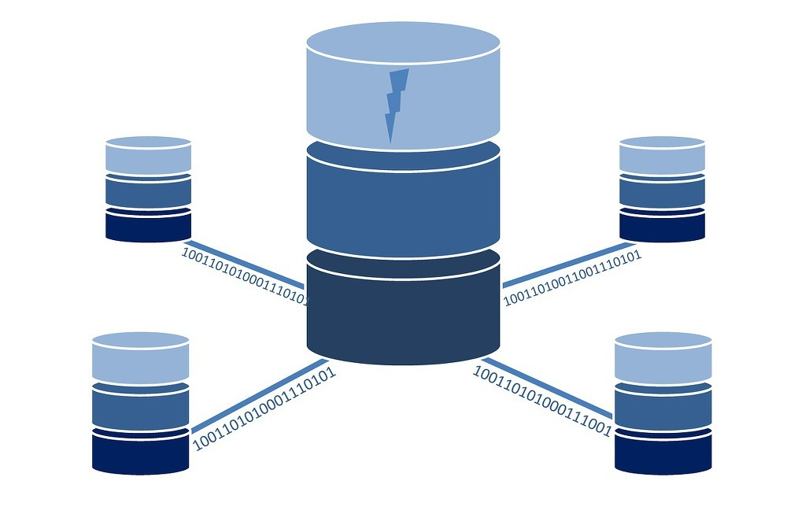
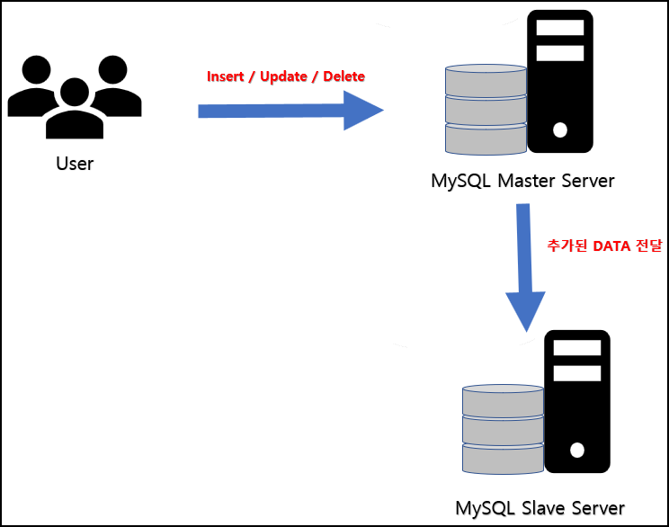
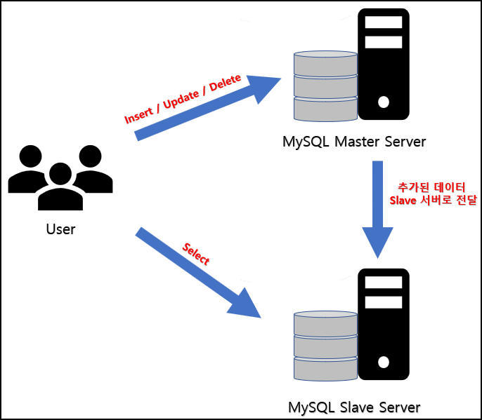

# Replication

웹 서버는 서버에 가해지는 부하를 줄이기 위해 로드 밸런싱을 도입할 수 있지만 DB 서버는 데이터를 저장하고 관리하는 서버이기 때문에 여러 서버로 분리하기 어렵다. 이러한 경우 DB 서버를 복제(Replication) 하여 DB 서버에 가해지는 부하를 줄일 수 있다.

MySQL Replication 은 복제를 뜻하며 2대 이상의 DBMS 를 나눠서 데이터를 저장하는 방식이다. 복제하기 위한 최소한의 구성은 Master / Slave 구조이다.

- Master DBMS
  - 웹 서버로부터 데이터 등록/수정/삭제 요청 시 바이너리 로그(Binarylog) 를 생성하여 Slave 서버로 전달한다.
  - 웹 서버로부터 오는 데이터 등록/수정/삭제 요청에 대해 처리하는 서버이다.
- Slave DBMS
  - Master DBMS 로부터 전달받은 바이너리 로그를 데이터로 반영한다.
  - 웹 서버로부터 오는 데이터 조회 요청에 대해 처리하는 서버이다.

## MySQL Replication 사용 목적

### 1. 실시간 데이터 백업

Master 서버에 등록/수정/삭제 요청이 들어올 경우 즉시 Slave 서버에 변경된 데이터를 전달한다. 실시간으로 전달함으로써 데이터를 일치시켜 백업 기능을 하는 것이다. 만약 Master 서버에 장애가 발생할 경우 Slave 서버를 Master 서버로 대체하여 사용할 수 있다.

### 2. DBMS 의 부하 분산

Master 서버는 등록/수정/삭제 요청을, Slave 서버는 조회 요청을 담당하도록 역할을 분리하여 부하를 분산한다. 두 서버의 데이터의 상태가 동일하도록 Master 서버에 데이터 변경이 일어나면 Slave 서버에 전달한다.

## 주의 사항

- 호환성을 위해 Replication 을 사용하는 MySQL 의 버전을 동일하게 맞춘다.
- Replication 을 사용하기에 MySQL 버전이 다른 경우 Slave 서버가 상위 버전이어야 한다.
- Replication 을 가동할 경우 Master -> Slave 순으로 동작시켜야 한다.

### 참고 사이트
- https://server-talk.tistory.com/240
