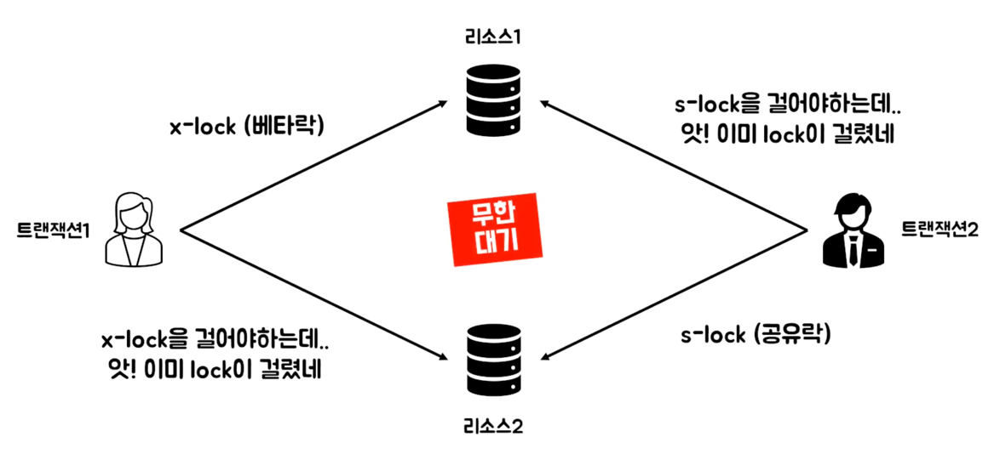

# Lock

## 낙관적 락(Optimisstic Lock)
- 충돌이 발생하지 않을 것임을 전제
- 트랜잭션이 시작되었을 때 변경하고 싶은 컬럼에 대한 version 을 읽어오고 이후에 변경될 시점에 다시 읽어와 초기의 version 과 동일한지 검증
  - 초기의 version 과 다시 읽어온 version 이 같다면 그대로 변경사항 적용 후 version 업데이트
  - version 이 다르다면 다른 트랜잭션에서 이미 변경되었으므로 충돌이 발생했다고 판단하여 롤백
- 동시성 업데이트가 거의 없는 경우에 사용

## 비관적 락(Pessimistic Lock)
- 무조건 충돌이 발생할 것임을 전제
- 트랜잭션이 시작되었을 때 변경하고 싶은 컬럼에 대해 Lock 을 걸어둠
  - Lock 이 걸려있기 때문에 다른 트랜잭션이 해당 row 에 접근하지 못함
- 동시 업데이트가 빈번한 경우에 사용
- 롤백하기 어려운 외부 시스템과 연동한 경우에 사용

### 비관적 락 연산의 종류

- 공유 락(Shared Lock)
  - 동시에 READ 연산 실행 가능, WRITE 연산은 실행 불가능
  - 데이터에 대한 사용권을 여러 트랜잭션이 함께 가질 수 있음

- 베타 락(eXclusive Lock)
  - 다른 트랜잭션에서 READ 연산과 WRITE 연산 모두 불가능
  - 베타 락 연산을 실행한 트랜잭션만 해당 데이터에 대한 독점권을 가짐

## 문제점: DeadLock

두 개 이상의 트랜잭션에서 접근하고자 하는 데이터를 무한히 대기하는 교착 상태에 빠질 수 있다.

- 트랜잭션 진행 방향을 같은 방향으로 처리
- 트랜잭션 처리 속도를 최소화
- Lock Timeout 을 이용하여 잠금 해제 시간을 조절

### 참고 사이트
- https://www.youtube.com/watch?v=ZXV6ZqMyJLg
