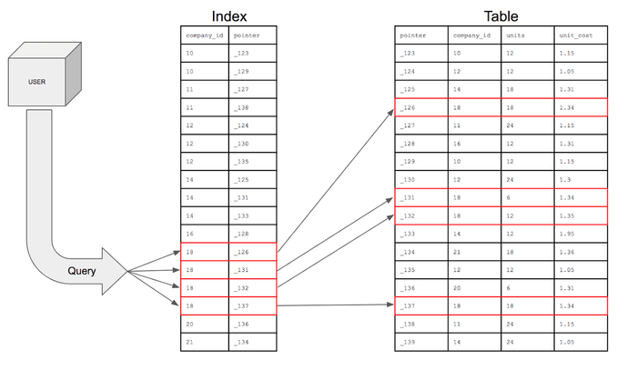
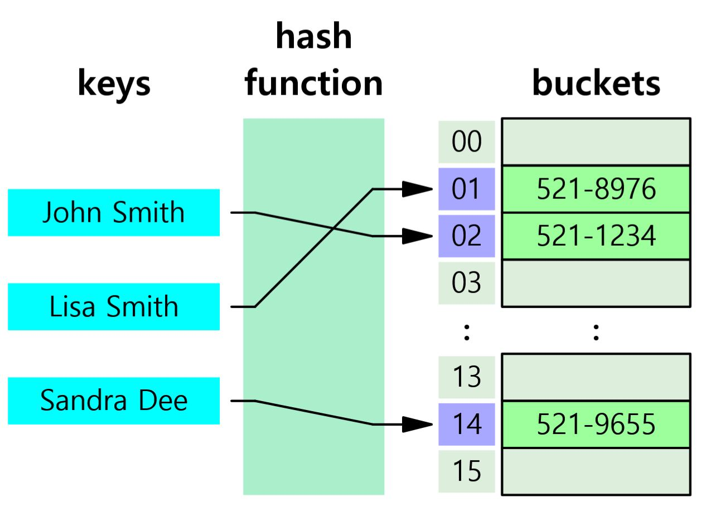
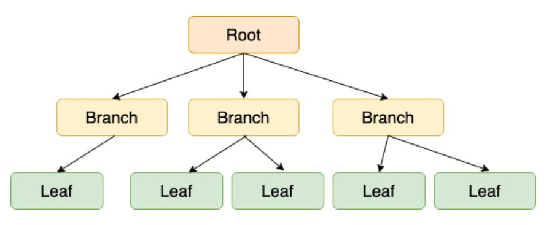
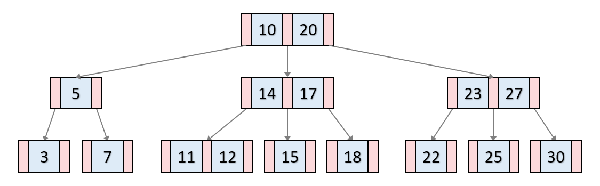
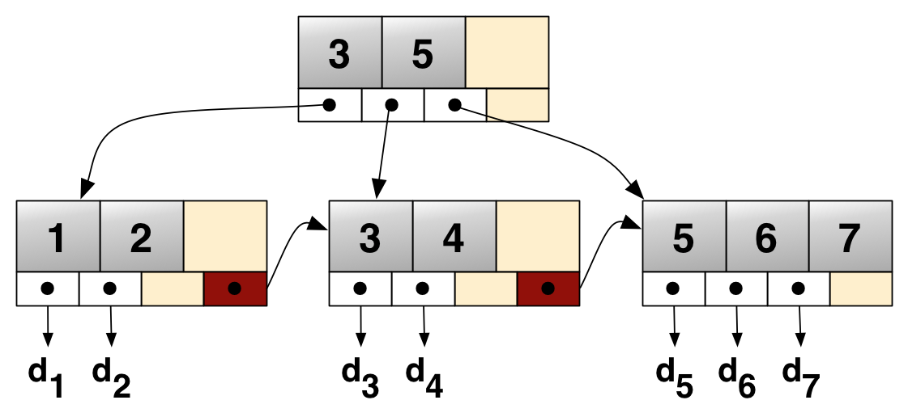

# Index

## Index 란?

DB 분야에 있어 테이블에 대한 동작의 속도를 높여주는 자료구조를 의미한다. Index 는 테이블 내 1개의 컬럼, 혹은 여러 개의 컬럼을 이용하여 생성될 수 있다. 고속의 검색 동작뿐만 아니라 레코드 접근과 관련 효율적인 순서 매김 동작에 대한 기초를 제공한다.

Index 가 걸려있지 않은 컬럼에 대한 정보를 조회하려면 실행 계획이 Full Table Scan 즉, 테이블을 전체 탐색해야 한다. 테이블에 데이터의 양이 많아질수록 검색에 소요되는 시간은 길어져 성능이 떨어진다. 

Index 는 데이터의 주소값을 저장하는 특별한 자료구조이다. 쿼리를 실행할 때 테이블을 전체 탐색하는 것이 아닌 해당 Index 를 바탕으로 원하는 데이터의 위치를 빠르게 검색한다. Index 는 테이블에 있는 하나 이상의 컬럼으로 생성이 가능하다.

## Index 자료구조

### Hash Table

- Key-Value 형식으로 이루어진 데이터를 저장하는데 특화된 자료구조
- 해시 함수는 Key 가 조금이라도 다르면 완전히 다른 해시값(Value) 를 생성하므로 등호 연산(=) 에는 좋지만, 부등호 연산(>, <) 에는 좋지 못함 -> 데이터베이스에서는 거의 사용하지 않음
- 해시 테이블은 내부 데이터들이 정렬되어 있지 않아 탐색에 효율적이지 않음

### B-Tree

- 자식 노드가 2개 이상인 트리
- 이진 검색 트리처럼 각 Key 의 왼쪽 자식은 항상 Key 보다 작은 값을, 오른쪽 자식은 큰 값을 가짐
- B-Tree 의 Key-Value 값은 항상 Key 를 기준으로 오름차순 정렬이므로 부등호 연산에 대해 해시 테이블보다 성능이 좋음
- 데이터 갱신(INSERT, UPDATE, DELETE) 이 반복되면 트리의 균형이 꺠져 성능 악화
- 부등호 + 순차 검색의 경우 중위 순회를 하기 때문에 효율이 좋지 않음

### B+Tree

- MySQL 엔진인 InnoDB 가 선택한 Index 자료구조
- B-Tree 구조를 확장한 구조로, 말단의 리프 노드에만 데이터의 위치(Value) 를 관리
- 말단의 리프 노드들끼리 LinkedList 구조로 서로를 참조하고 있어, 부등호 + 순차 검색에 효율이 좋음

## Index 설정 시 고려사항

Index 를 사용하면 검색 성능이 높아지지만 잘못 설계된 Index 는 오히려 성능이 나빠질 수 있다. Index 는 항상 최신 상태로 정렬되기 위해 데이터 갱신 작업에 대해 추가적인 연산이 발생한다.

- INSERT : 새로운 데이터에 대한 인덱스 추가
- DELETE : 삭제하는 데이터의 인덱스를 제거
- UPDATE : 기존의 인덱스를 제거하고, 갱신된 데이터에 대한 인덱스 추가

Index 를 설정할 때는 일반적으로 카디널리티(Cardinality) 가 높은 컬럼을 선택한다. 중복적인 값이 적은 컬럼을 선택하면 Index 를 통해 중복적이지 않은 값들은 모두 걸러지기 때문에 성능에 좋다.

여러 컬럼으로 Index 를 구성하였을 때에는 인덱스의 순서도 중요하다. 여러 컬럼을 묶어 인덱스를 설정한다면 A -> B -> C 의 순서로 적용되기 때문에 A 컬럼에서 최대한 데이터가 많이 걸러지는 경우가 좋다. 즉, A 가 카디널리티가 높은 컬럼이면 좋다. 

다만, 여러 컬럼으로 이루어진 인덱스는 주의사항이 있는데 인덱스의 순서대로 조회를 하므로 앞선 컬럼을 무조건 포함시켜야 한다. 예를 들어 A, A -> B, A -> B -> C 는 가능하지만, B, C, B -> C 의 경우 인덱스를 사용하지 않는다. (조건 설정 시 순서는 중요하지 않다. 포함되어 있기만 하면 된다.)

그 외의 인덱스 사용 시 주의사항은 다음과 같다.

- `between`, `like`, `<`, `>` 등 범위 조건은 인덱스를 타지만, 그 이후의 인덱스는 적용되지 않는다.
- 반대로 `=`, `in` 은 이후의 컬럼도 인덱스가 적용된다.
  - `in` 은 `=` 를 여러번 실행한 것과 동일하다.
- `AND` 연산자는 각 조건들이 읽어와야 할 ROW 의 수를 줄이지만 `OR` 연산자는 비교해야 할 ROW 를 증가시키므로 Full Table Scan 이 발생할 확률이 높다.
- 인덱스로 사용된 컬럼값 그대로 사용해야 인덱스가 적용된다.
  - where salary * 10 > 150000; -> 인덱스 사용 불가능
  - where salary > 150000 / 10; -> 인덱스 사용 가능
  - 컬럼이 문자열인데 숫자로 조회하면 타입이 달라 인덱스가 사용되지 않는다.

### 참고 사이트
- https://tecoble.techcourse.co.kr/post/2021-09-18-db-index/
- https://jojoldu.tistory.com/243
