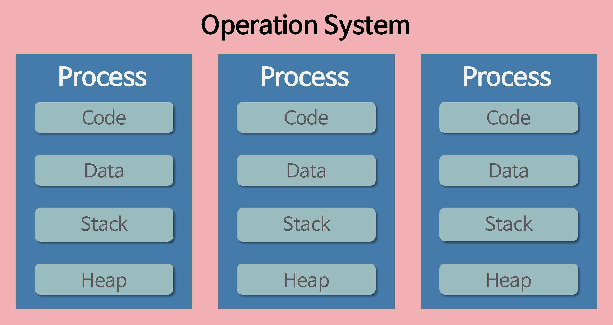

# Process 와 Thread

## Program

- 어떤 작업을 위해 실행할 수 있는 파일

## Process

- 컴퓨터에서 연속적으로 실행되고 있는 컴퓨터 프로그램
- 메모리에 올라와 실행되고 있는 프로그램의 인스턴스 (독립적인 개체)
- 운영체제로부터 시스템 자원을 할당받는 작업의 단위
  - CPU 시간
  - 운영되기 위해 필요한 주소 공간
  - Code, Data, Stack, Heap 의 구조로 되어있는 메모리 영역
- 동적인 개념으로는 실행되는 프로그램
- 프로세스는 기본적으로 최소 1개의 스레드(메인 스레드) 를 보유한다.
- 각 프로세스는 별도의 주소 공간에서 실행되며, 한 프로세스는 다른 프로세스 변수나 자료구조에 접근할 수 없다.

## Thread

- 프로세스 내에서 실행되는 여러 흐름의 단위
- 프로세스가 할당받은 자원을 이용하는 실행의 단위
- 스레드는 프로세스 내에서 `Stack` 만 별도로 할당받고 그 외의 영역은 공유한다.
- 각각의 스레드는 별도의 `Stack` 과 `Register` 를 보유한다.
- 한 스레드가 프로세스 자원을 변경하면 다른 스레드에서도 변경 사항을 확인할 수 있다.

## Java Thread

- 일반 스레드와 차이가 없으며, JVM 이 운영체제의 역할을 한다.
- 자바에는 프로세스가 없고 스레드만 존재하며, 스레드는 JVM 에 의해 스케쥴링 된다.
  - Thread 의 개수
  - Thread 로 실행되는 프로그램 코드의 메모리 위치
  - Thread 의 상태
  - Thread 우선 순위

### 참고 사이트
- https://gmlwjd9405.github.io/2018/09/14/process-vs-thread.html
