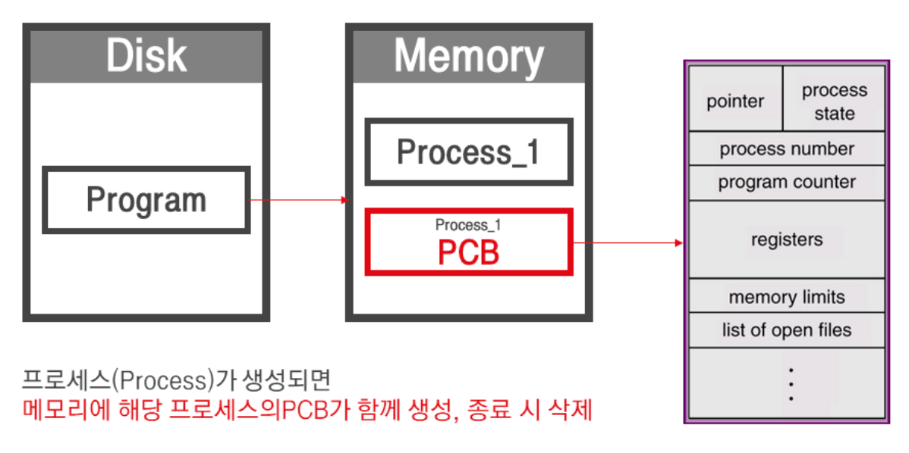
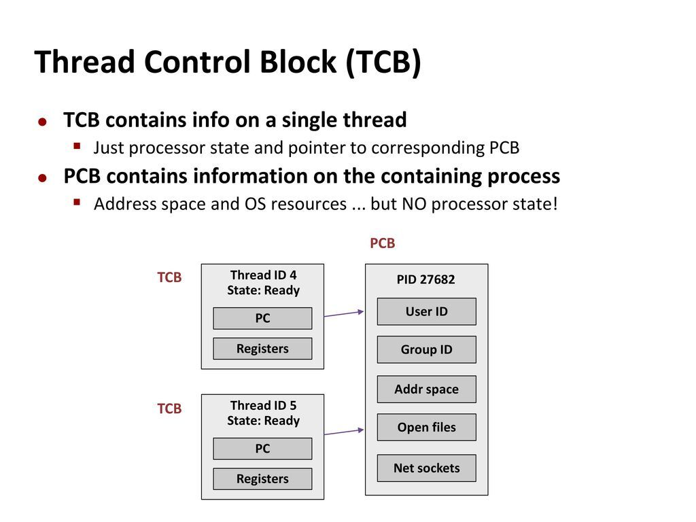

# Context Switching

CPU 를 차지하던 프로세스가 나가고 새로운 프로세스를 받아들이는 작업이다. 기본적으로 CPU 는 하나의 프로세스만 실행 가능하기 때문에 실행중이던 프로세스의 시간이 종료되거나, 인터럽트가 발생하면 다른 프로세스로 교체된다. 지금까지의 작업 내용을 PCB 에 저장하고, 반대로 실행 상태로 들어오는 PCB 의 내용으로 CPU 가 셋팅된다. 이와 같이 두 프로세스의 제어 블록을 교환하는 작업이 문맥 교환(Context Switching) 이다.

- 실행중인 프로세스에 할당된 시간이 종료될 경우
- 인터럽트가 발생했을 경우

## Context

CPU 가 해당 프로세스를 실행하기 위한 프로세스의 정보들

### PCB (Process Control Block)

- Context 는 PCB(Process Control Block) 에 저장된다.
  - 프로세스 상태 (생성, 준비, 수행, 대기, 중지)
  - 프로그램 카운터
  - 레지스터
  - 프로세스 번호
- 프로세스를 실행하는 데 필요한 중요한 정보를 보관하는 자료 구조
- 프로세스 생성 시 만들어지며 프로세스가 실행을 종료하면 폐기
- 컨텍스트 스위칭을 실행할 때 CPU 는 작업이 중단되어 오버헤드가 발생하여 효율이 떨어진다.
  - 오버헤드 : 어떤 처리를 하기 위해 들어가는 간접적인 처리 시간, 메모리 등
  - 프로세스는 공유 영역이 없기 때문에 Context Switching 시 새로운 캐시 정보를 쌓아햐 한다.

### TCB (Thread Control Block)

- 스레드를 실행하는 데 필요한 중요한 정보를 보관하는 자료 구조
- 스레드의 Context 는 TCB 에 저장된다.
- 스레드는 공유 영역이 많기 때문에 Context Switching 이 빠르다.

### 참고 사이트
- 책) 쉽게 배우는 운영체제
- https://applefarm.tistory.com/105
- https://teraphonia.tistory.com/802
