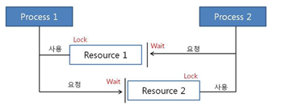

# 교착 상태와 기아 상태

## DeadLock (교착 상태)

- 두 개 이상의 프로세스나 스레드가 서로 자원을 얻지 못해 다음 처리를 하지 못하는 상태
- 무한히 다음 자원을 기다리는 상태
- 시스템 적으로 한정된 자원을 여러 곳에서 사용하려 할 때 발생

### DeadLock 이 발생하는 상황

- t1 : 프로세스1이 자원1을 얻음 / 프로세스2가 자원2를 얻음
- t2 : 프로세스1은 자원2를 기다림 / 프로세스2는 자원1을 기다림

서로의 자원에 접근하기 위해 무한 대기하는 상태 -> DeadLock

### DeadLock 발생 조건

4 가지 조건 모두 성립해야 데드락 발생

- 상호 배제 (Mutual exclusion)
  - 자원은 한 번에 한 프로세스만 접근할 수 있음
- 점유 대기 (Hold and wait)
  - 최소한 하나의 자원을 점유하고 있으면서 다른 프로세스에 할당되어 사용되고 있는 자원을 추가로 점유하기 위해 대기하는 프로세스가 존재해야 함
- 비선점 (No preemption)
  - 다른 프로세스에 할당되어 있는 자원은 사용이 끝날 때까지 빼앗을 수 없음
- 순환 대기 (Circular wait)
  - 프로세스의 집합에서 순환 형태로 자원을 대기하고 있어야 함

## Starvation (기아 상태)

프로세스의 우선 순위가 낮아 자원에 할당받지 못하는 상태

### Starvation 해결 방안

- 프로세스 우선 순위를 수시로 변경
- 오래 기다린 프로세스의 우선 순위 조정
- 우선 순위가 아닌 요청 대기 큐 사용

### 참고 사이트
- https://gyoogle.dev/blog/computer-science/operating-system/DeadLock.html
- https://velog.io/@underlier12/OS-24-%EA%B5%90%EC%B0%A9%EC%83%81%ED%83%9C%EC%99%80-%EA%B8%B0%EC%95%84%EC%83%81%ED%83%9C
