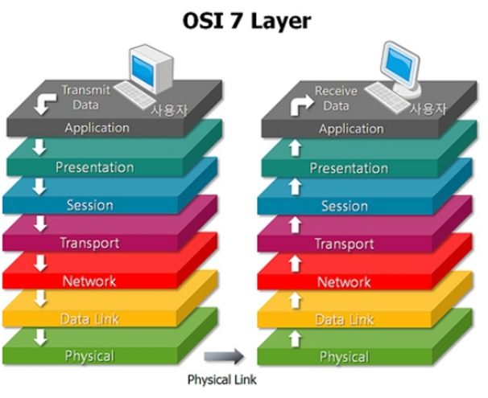
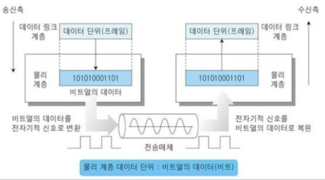
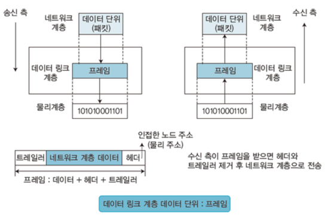
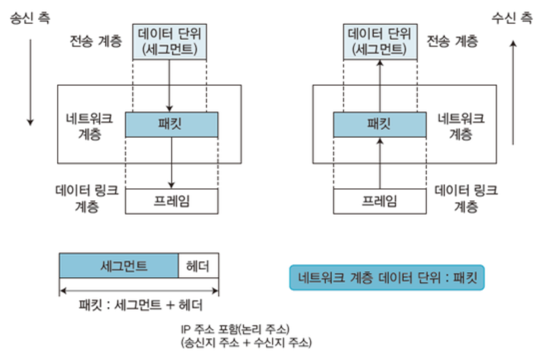
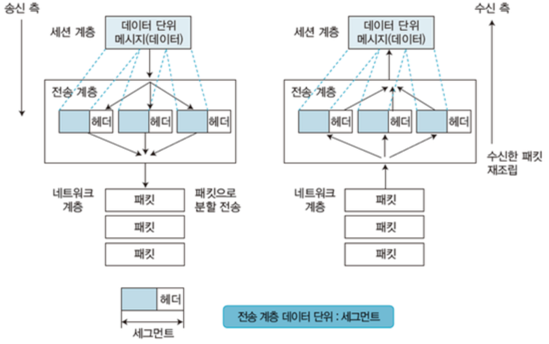
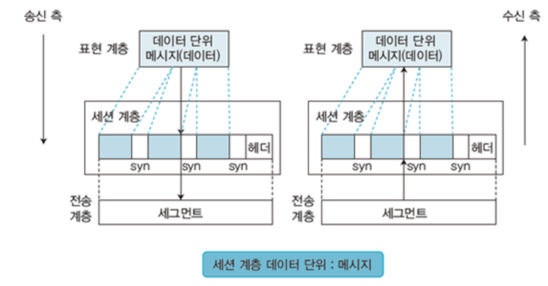
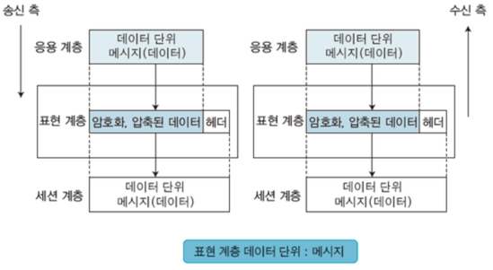
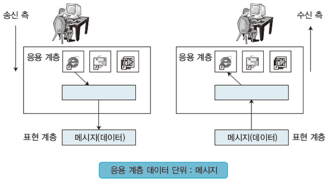
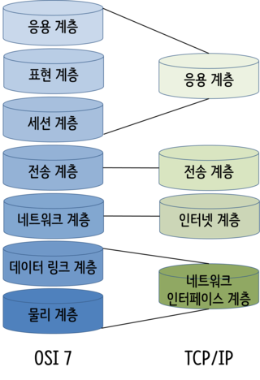

# OSI 7계층과 TCP/IP 4계층

인터넷 망에서 멀리 떨어져 있는 두 컴퓨터 사이에 데이터를 전송하기 위해서는 서로 간의 약속이 필요하다. 서로 다른 스펙으로 이루어져 있는 컴퓨터 사이의 원활한 전송을 위해서 각 단계에서 어떤 형식으로 데이터를 주고 받을지 약속해놓은 것을 **프로토콜**이라고 한다. 각 단계별로 계층이라는 단위로 세분화하여 역할을 정하고, 계층에서 사용하는 프로토콜을 정의해 놓은 것이 있다. 대표적으로 OSI 7계층과 TCP/IP 모델이 있다.

## OSI 7계층

초창기의 네트워크는 각 컴퓨터마다 시스템에 달랐기 때문에 하드웨어나 소프트웨어의 논리적인 변경 없이 통신할 수 있는 표준 모델이 필요했다. 컴퓨터들의 스펙이 달라도 통신할 수 있도록 계층을 세분화하여 정의한 것이 OSI 7계층이다.

### 1계층: 물리 계층 (Physical Layer)

- 기계어 -> 전기적 신호
- 전기적 신호로 변환된 데이터를 물리 매체를 통해 다른 시스템에 전송한다.
- 대표적인 장비 : 케이블, 허브

**참고 사이트**
- https://blog.naver.com/kyg3766/220691506863

### 2계층: 데이터 링크 계층 (Link Layer)

- 네트워크 기기들 사이에 데이터를 전송한다.
- 대표적인 장비 : L2 스위치
- 대표적인 프로토콜 : MAC

**참고 사이트**
- https://blog.naver.com/kyg3766/220691524213

### 3계층: 네트워크 계층 (Network Layer)

- 다른 네트워크 사이에 데이터를 전송한다.
- 대표적인 장비 : 라우터, L3 스위치
- 대표적인 프로토콜 : IP, ARP

**참고 사이트**
- https://blog.naver.com/kyg3766/220691563209

### 4계층: 전송 계층 (Transport Layer)

- 발신지에서 목적지 간 제어와 에러를 관리
- 신뢰 있는 통신 보장
- 주소 설정, 오류 및 흐름 제어, 다중화
- 대표적인 장비 : 게이트웨이, L4 스위치
- 대표적인 프로토콜 : TCP, UDP

**4계층 전송 계층 vs 3계층 네트워크 계층**
네트워크 계층은 **호스트** 간 논리적 통신을 돕지만, 전송 계층은 **응용 애플리케이션** 간 논리적 통신을 돕는다.

**참고 사이트**
- https://blog.naver.com/kyg3766/220694266577

### 5계층: 세션 계층 (Session Layer)

- 발신지와 목적지의 포트 기반 최초 연결 및 유지
- 대표적인 프로토콜 : SSL, TLS

**참고 사이트**
- https://blog.naver.com/kyg3766/220694297437

### 6계층: 표현 계층 (Presentation Layer)

- 전달받은 데이터를 올바른 표준 방식으로 변환 (전송을 위한 포맷으로 변환)
  - 압축, 암호화 등
- 대표적인 프로토콜 : JPEG, MPEG

**참고 사이트**
- https://blog.naver.com/kyg3766/220694305970

### 7계층: 응용 계층 (Application Layer)

- 전달받은 데이터를 사용자에게 전달
- 사용자 인터페이스 역할을 담당
- 대표적인 프로토콜 : DNS, FTP, HTTP

**참고 사이트**
- https://blog.naver.com/kyg3766/220694313116

## TCP/IP 4계층

OSI 7계층은 참조 모델일 뿐 실제로는 7계층을 모두 따르지는 않는다. 실제 주로 사용되는 모델은 TCP/IP 모델이다.

TCP/IP 모델은 OSI 7계층을 4계층으로 축약한 모델이다.

### 참고 사이트
- https://velog.io/@hidaehyunlee/%EB%8D%B0%EC%9D%B4%ED%84%B0%EA%B0%80-%EC%A0%84%EB%8B%AC%EB%90%98%EB%8A%94-%EC%9B%90%EB%A6%AC-OSI-7%EA%B3%84%EC%B8%B5-%EB%AA%A8%EB%8D%B8%EA%B3%BC-TCPIP-%EB%AA%A8%EB%8D%B8
