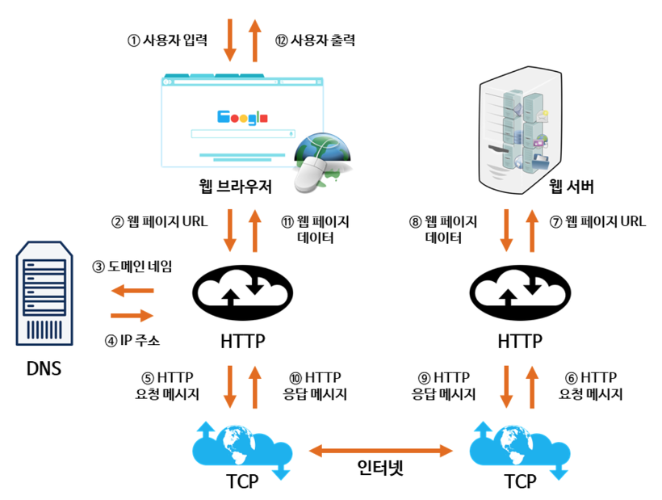

# 웹 통신의 큰 흐름: https://www.google.com/ 을 접속할 때 일어나는 일

- 사용자는 브라우저 검색창에 접속하고 싶은 페이지의 도메인 주소를 입력한다.
- 브라우저는 HTTP 메시지를 송신하는 기능이 없으므로 HTTP 메시지를 보내기 위해 OS 에 요청한다. 단, OS 의 네트워크 송신 기능은 도메인 주소가 아닌 IP 주소를 필요로 한다. 그러므로 DNS 서버에 저장되어 있는 도메인 주소에 매칭되는 IP 주소를 찾아야 한다.
- 요청을 보내고 싶은 IP 주소가 담긴 HTTP 요청 메시지를 생성한다.
- IP 주소를 보고 요청을 보낸 서버를 찾는다.
- 사용자가 요청한 URL 에 대한 응답을 서버에게 요청한다.
- 요청한 URL 에 대한 응답을 반환한다.
- 응답 데이터가 담긴 HTTP 응답 메시지를 생성한다. 요청을 보낸 PC 에게 응답하기 위해 이번에는 도착지의 IP 가 요청 메시지에 담겨있던 출발지의 IP 가 된다.
- IP 주소를 보고 요청을 보낸 브라우저를 찾는다.
- 요청을 보냈던 웹 브라우저에게 응답된 데이터를 전달한다.
- 받은 응답 데이터를 사용자에게 출력한다.

### 참고 사이트
- https://velog.io/@sangmin7648/%EC%9B%B9-%ED%86%B5%EC%8B%A0%EC%9D%98-%ED%81%B0-%ED%9D%90%EB%A6%84
- https://yaelimeee.tistory.com/50
