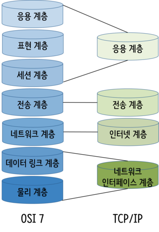
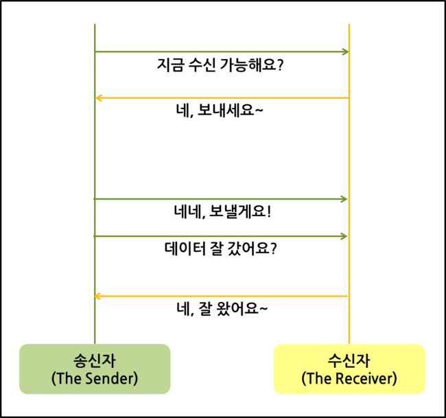
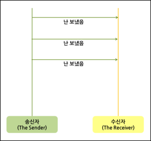

# TCP와 UDP의 차이점

TCP 와 UDP 는 TCP/IP 모델의 `전송계층` 에서 사용되는 프로토콜이다. 

    
TCP/IP 모델

    

        

        

            네트워크 상에서 컴퓨터와 컴퓨터 사이에 데이터를 전송하기 위해서는 요청을 보내는 컴퓨터와 응답을 받는 컴퓨터 사이의 규칙들이 동일해야 한다. 요청을 보낸 메시지를 올바르게 해석하기 위해 지정해놓은 규칙을 <b>프로토콜</b> 이라고 한다. 컴퓨터에서 요청을 보내고 싶은 데이터를 이용하여 요청 메시지를 생성하고, 다른 컴퓨터로 요청을 보내기까지 여러 가지의 규칙들이 필요하다. 각 계층에서 필요한 여러 규칙들을 모아 정의해 놓은 것중의 하나가 <b>TCP/IP 모델</b> 이다.
        

         
        

            TCP/IP 모델은 OSI 7계층과는 달리 응용 계층, 전송 계층, 인터넷 계층, 네트워크 인터페이스 계층의 4단계로 이루어져 있다.
        

         
        

            <a href="https://velog.io/@hidaehyunlee/%EB%8D%B0%EC%9D%B4%ED%84%B0%EA%B0%80-%EC%A0%84%EB%8B%AC%EB%90%98%EB%8A%94-%EC%9B%90%EB%A6%AC-OSI-7%EA%B3%84%EC%B8%B5-%EB%AA%A8%EB%8D%B8%EA%B3%BC-TCPIP-%EB%AA%A8%EB%8D%B8">참고 사이트</a>
        

    

## TCP: Transmission Control Protocol

- `3-way handshake` 를 이용하여 신뢰성 있는 데이터 전송을 목표로 한다.
  - `3-way handshake` 란 보내고 싶은 데이터를 보내기 전에 수신자가 응답 가능한 상태인지 확인하기 위해 거치는 절차이다.
- 패킷을 지정된 순서대로 수신하도록 보장한다.
  - TCP 헤더에 시퀀스 번호가 존재하여 수신자는 도착한 메시지를 어떤 순서로 확인해야 하는지 알 수 있다.

## UDP: User Datagram Protocol

- 수신자가 데이터를 제대로 받았는지 보장하지 않는다.
- 데이터를 송신 후의 일은 고려하지 않아 TCP 보다 속도가 빠르다.

### 참고 사이트
- https://velog.io/@hidaehyunlee/TCP-%EC%99%80-UDP-%EC%9D%98-%EC%B0%A8%EC%9D%B4
