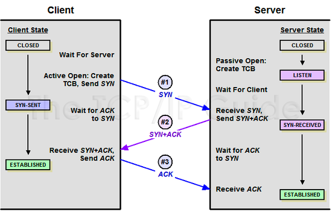
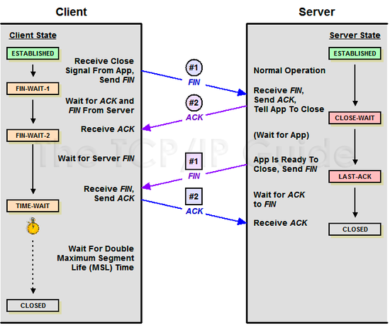

# TCP 3-way handshake 와 4-way handshake

## 3-way handshaking


TCP 프로토콜에서는 신뢰성 있는 데이터 전달을 보장한다. 클라이언트가 서버에게 데이터를 요청할 때, 서버가 응답할 수 있는 상태인지 확인하기 위해 `3-way handshaking` 을 이용한다.

```text
Client > Server : SYN
Server > Client : SYN ACK
Client > Server : ACK
```

- SYN : synchronize sequence numbers
- ACK : acknowledgment

클라이언트가 서버에 접속하기 위해 SYN 패킷을 보내고 서버의 응답을 기다린다. 서버는 클라이언트의 요청을 수락한다는 여부인 ACK 와 SYN 를 보내고 클라이언트의 응답을 기다린다. 서버의 응답을 확인했다는 의미로 클라이언트는 서버에게 ACK 패킷을 보낸다. 이후 클라이언트와 서버와의 연결이 이어져 데이터를 주고 받을 수 있게 된다.

## 4-way handshaking


3-way handshaking 은 서버와 데이터를 주고 받기 위해 서버의 상태 확인 및 TCP 연결 초기화 단계이다. `4-way handshaking` 은 세션을 종료하기 위한 절차이다.

클라이언트가 연결을 종료하겠다는 FIN 플래그를 전송한다. 서버는 일단 확인했다는 의미로 ACK 패킷을 보낸 이후 통신이 종료될 때까지 대기한다. 통신이 종료되면 클라이언트에게 종료되었음을 알린다. 클라이언트는 서버에게 확인했다는 메시지를 보낸다.

클라이언트가 보낸 FIN 플래그에 대해 확인했다는 메시지가 통신 장애로 세션이 완료되었다는 메시지보다 늦게 도착할 경우를 대비하여, 클라이언트는 세션 종료가 완료되었다는 응답을 받아도 일정 시간동안 세션을 유지한다.

### 참고 사이트
- https://mindnet.tistory.com/entry/%EB%84%A4%ED%8A%B8%EC%9B%8C%ED%81%AC-%EC%89%BD%EA%B2%8C-%EC%9D%B4%ED%95%B4%ED%95%98%EA%B8%B0-22%ED%8E%B8-TCP-3-WayHandshake-4-WayHandshake
