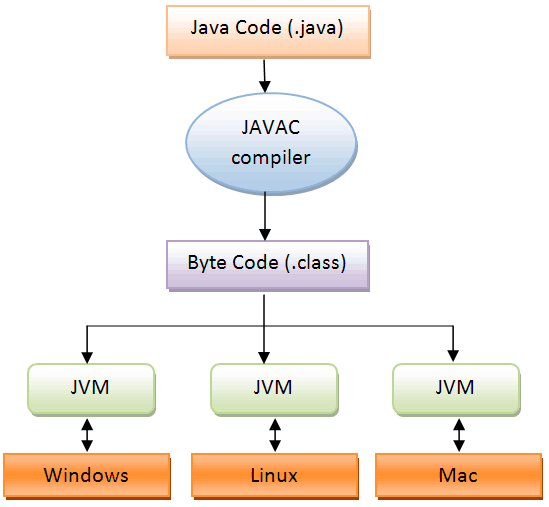
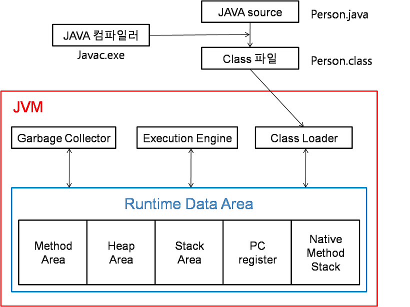
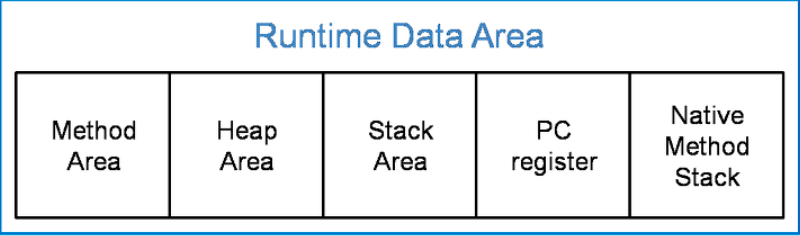

# JVM 구조와 Java 의 실행 방식

## Java 실행 단계

JVM 은 Java Virtual Machine 의 약자로 자바 가상 머신이다. JVM 은 자바 프로그램이 운영체제에 관계 없이 실행될 수 있도록 도와준다. 다만 그림에서 보듯이 JVM 은 운영체제에 종속적이다. Mac OS 를 사용한다면 Mac OS 에서 사용하는 JVM 을 설치해야 한다.

## JVM 구조와 Java 실행 방식

### Class Loader

자바 프로그램이 실행될 때 `.java` 파일을 자바 컴파일러가 컴파일하여 `.class` 파일을 생성한다. 런타임 시에 동적으로 클래스들을 로드한다.

### Execution Engine

클래스 로드를 통해 JVM 내의 Runtime Data Area 에 배치된 바이트 코드들을 명령어 단위로 읽어 실행한다.

### Garbage Collector

Heap Area 에 있는 객체들 중 더이상 참조되지 않는 객체들을 제거한다.

### Runtime Data Area

JVM 의 메모리 영역으로 자바 어플리케이션에서 사용하는 데이터를 적재하는 영역이다.

#### Method Area

모든 쓰레드가 공유하는 영역이다. 메소드 영역은 클래스, 인터페이스, 메소드, 필드, static 변수 등의 바이트 코드를 저장한다.

#### Heap Area

모든 쓰레드가 공유하며, `new` 키워드로 생성된 객체와 배열을 저장한다. 메소드 영역에 로드된 클래스만 생성이 가능하며 Garbage Collector 의 관리를 받는 대상이다.

#### Stack Area

메서드 호출 시 각각의 스택 프레임을 생성한다. 메서드 안에서 사용하는 값들을 임시로 저장한다. (매개변수, 지역변수, 리턴값, 연산 시 일어나는 값 등) 메서드가 수행을 종료하면 제거된다.

#### PC Register

쓰레드가 시작될 때 생성한다. 쓰레드가 어떤 부분을 실행하고 있었는지를 기록하는 부분으로 현재 수행중인 JVM 의 주소를 갖는다.

#### Native Method Stack

자바 외 언어로 작성된 네이티브 코드를 위한 영역이다.

### 참고 사이트
- https://steady-coding.tistory.com/305
