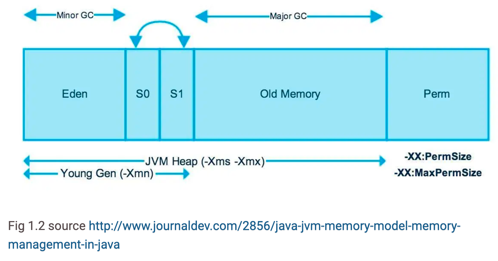

# GC 의 개념와 동작 방식

## GC 의 개념

메모리를 직접 관리하는 C 언어는 사용하지 않는 메모리를 직접 해제하여 메모리 누수를 방지한다. Java 는 JVM 이 불필요한 메모리를 관리해주기 때문에 개발자가 메모리를 고려하지 않아도 된다. 

GC 는 다음과 같은 전제로 설계되었다.

- 대부분의 객체는 금방 접근 불가능한 상태(Unreachable)가 된다. 
- 오래된 객체에서 새로운 객체로의 참조는 아주 적게 존재한다.

생성된 객체가 참조되는 횟수를 기반으로 언제까지 메모리에 유지할 지 결정한다.

## Garbage Collection 의 동작 방식

### Stop The World

GC 를 실행하기 위해 JVM 이 자바 어플리케이션의 실행을 멈추는 과정이다. GC 를 실행하는 쓰레드를 제외한 모든 쓰레드의 작업이 중단되고, GC 가 작업을 완료하면 재개된다. 모든 쓰레드의 작업이 중단되면 어플리케이션도 멈추기 때문에, GC 의 성능 개선을 위해 튜닝한다면 Stop The World 의 시간을 줄이는 편이다.

### Mark and Sweep

- **Mark**: 사용되는 메모리와 사용되지 않는 메모리를 식별하는 작업
- **Sweep**: Mark 단계에서 사용되지 않음으로 식별된 메모리를 해제하는 작업

Stop The World 를 통해 자바 어플리케이션의 실행이 중단되면, GC 는 스택의 모든 변수 또는 접근 가능한 객체를 스캔하면서 각각 어떤 객체를 참조하고 있는지 식별한다. (`Mark`) 이후 Mark 되지 않는 메모리를 제거하는 작업을 진행한다. (`Sweep`)

### Minor GC

JVM heap area 의 Young 영역은 Eden 영역과 Survivor 영역으로 나뉜다.

- **Eden 영역** : 새로 생성된 객체가 할당되는 영역
- **Survivor 영역** : 최소 1번 이상의 GC 에서 살아남은 객체들이 저장된 영역

Minor GC 는 다음과 같은 과정을 거쳐 진행된다.

Eden 영역에 새로 생성된 객체 할당 -> Eden 영역이 가득 참 -> Eden 영역에서 참조되는 객체들을 메모리 해제하여 하나의 Survivor 영역으로 이동(Minor GC) -> Minor GC 의 과정이 반복되다가 Survivor 영역이 가득 차면, 계속해서 참조되는 객체들에 한해 다른 Survivor 영역으로 이동 -> 이러한 과정을 반복하여 살아남은 객체는 Old 영역으로 이동

### Major GC

Minor GC 가 계속 발생하여 JVM heap area 의 Old 영역이 가득 차면 발생한다. Young 영역은 크기가 작아 0.5초에서 1초 사이에 끝난다. Old 영역은 Young 영역에 비해 크기가 크기 때문에 발생하는 시간이 Minor GC 보다 아주 크다.

### 참고 사이트
- https://mangkyu.tistory.com/118

