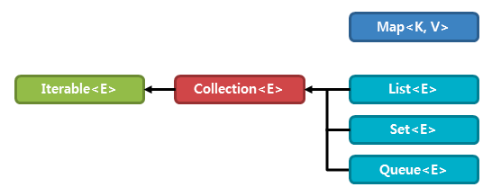

# Collection Framework 란?

다수의 데이터를 쉽게 관리하기 위한 Interface 이다. 컬렉션 프레임워크의 주요 인터페이스는 `List`, `Set`, `Map` 등이 있다. 여기서 `List` 와 `Set` 은 동일한 Collection 인터페이스를 상속받지만, `Map` 은 구조적 차이로 인해 별도의 인터페이스로 구현되어 있다.

### 참고 사이트
- http://www.tcpschool.com/java/java_collectionFramework_concept
